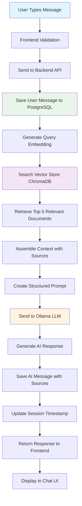
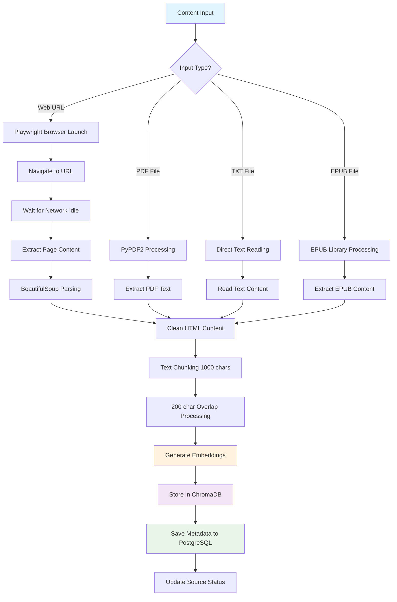
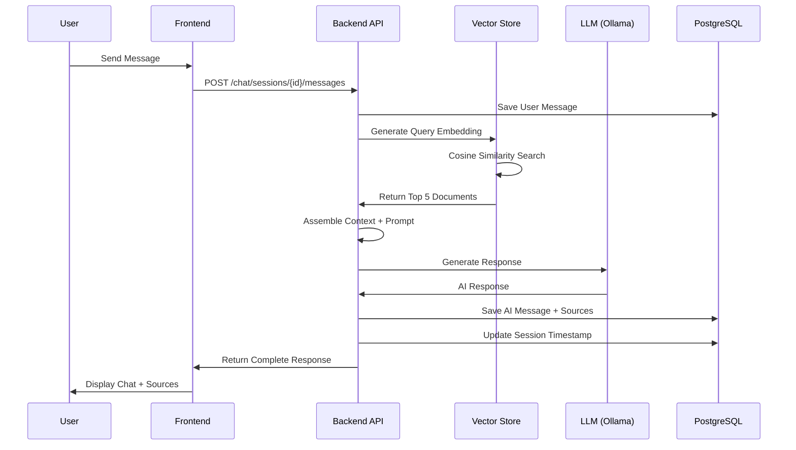
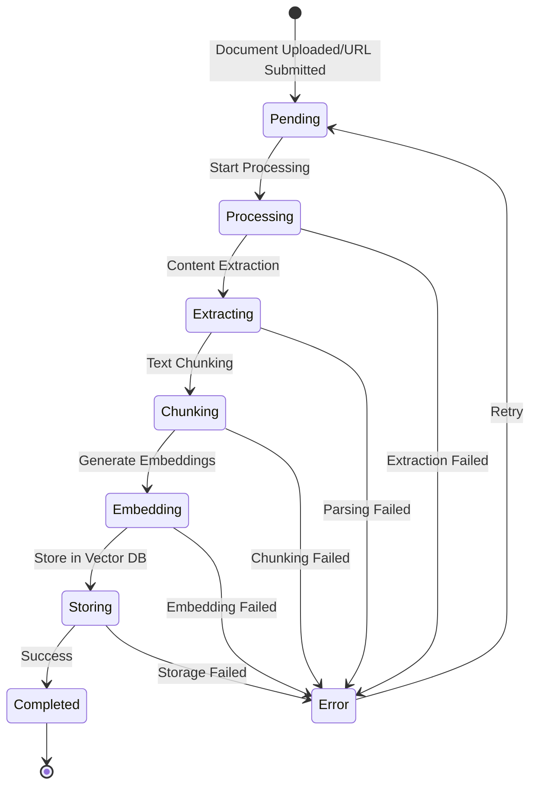
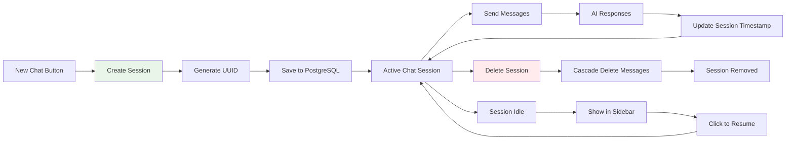

# Knowledge Base Agent - Business Logic Flow Analysis

## 📊 Detailed Business Logic Flows

### 1. Complete Chat Message Processing Pipeline



### 2. Knowledge Ingestion Business Logic



### 3. RAG (Retrieval-Augmented Generation) Process



### 4. Document Processing State Machine



### 5. Chat Session Lifecycle



## 🔧 Service Integration Patterns

### 1. Vector Store Integration Pattern
```python
# Business Logic Flow in VectorStore Service
async def add_document(content: str, metadata: Dict) -> str:
    # 1. Text Chunking Strategy
    chunks = self._chunk_text(content, chunk_size=1000, overlap=200)
    
    # 2. Embedding Generation
    for chunk in chunks:
        embedding = self.embedder.encode(chunk).tolist()
        
        # 3. Metadata Enhancement
        chunk_metadata = {**metadata, "chunk_index": i, "total_chunks": len(chunks)}
        
        # 4. Vector Storage
        self.collection.add(ids=[doc_id], embeddings=[embedding], 
                           documents=[chunk], metadatas=[chunk_metadata])
```

### 2. LLM Integration Pattern
```python
# RAG Context Assembly Business Logic
async def generate_response(query: str, context: List[Dict]) -> str:
    # 1. Context Preparation
    context_text = "\n\n".join([
        f"Source: {doc['metadata'].get('url', 'Unknown')}\n{doc['content']}"
        for doc in context
    ])
    
    # 2. Prompt Engineering
    prompt = f"""You are a helpful AI assistant with access to a personal knowledge base.
    Context: {context_text}
    Question: {query}
    Answer:"""
    
    # 3. LLM Generation with Parameters
    payload = {
        "model": self.chat_model,
        "prompt": prompt,
        "options": {"temperature": 0.7, "top_p": 0.9}
    }
```

### 3. Database Transaction Pattern
```python
# Chat Message Processing Transaction
async def send_message(session_id: UUID, content: str, db: AsyncSession):
    # 1. Save User Message
    user_message = ChatMessage(session_id=session_id, content=content, role="user")
    db.add(user_message)
    
    # 2. Vector Search
    relevant_docs = await vector_store.search(content, n_results=5)
    
    # 3. Generate AI Response
    ai_response = await llm.generate_response(content, relevant_docs)
    
    # 4. Save AI Message with Sources
    ai_message = ChatMessage(session_id=session_id, content=ai_response, 
                           role="assistant", sources=sources)
    db.add(ai_message)
    
    # 5. Update Session Timestamp
    session.updated_at = func.now()
    
    # 6. Commit Transaction
    await db.commit()
```

## 📈 Performance & Scalability Considerations

### 1. Vector Search Performance
- **Chunk Size**: 1000 characters optimal for semantic coherence
- **Overlap**: 200 characters prevents context loss at boundaries
- **Top-K Retrieval**: Limited to 5 documents for response quality
- **Embedding Model**: all-MiniLM-L6-v2 (384 dimensions, fast inference)

### 2. Database Optimization
- **Indexes**: session_id, created_at, url for fast queries
- **JSONB**: Flexible metadata storage with efficient querying
- **UUID**: Distributed-friendly primary keys
- **Cascade Deletes**: Automatic cleanup of related records

### 3. LLM Processing
- **Local Processing**: Complete privacy, no external API calls
- **Model Size**: 8B parameters balanced for quality/speed
- **Context Window**: Large enough for multiple document chunks
- **Temperature**: 0.7 for balanced creativity/accuracy

This business logic architecture ensures efficient, scalable, and privacy-focused knowledge management with intelligent retrieval and generation capabilities.
